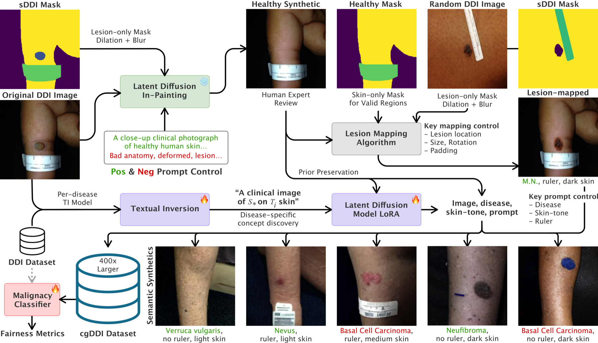
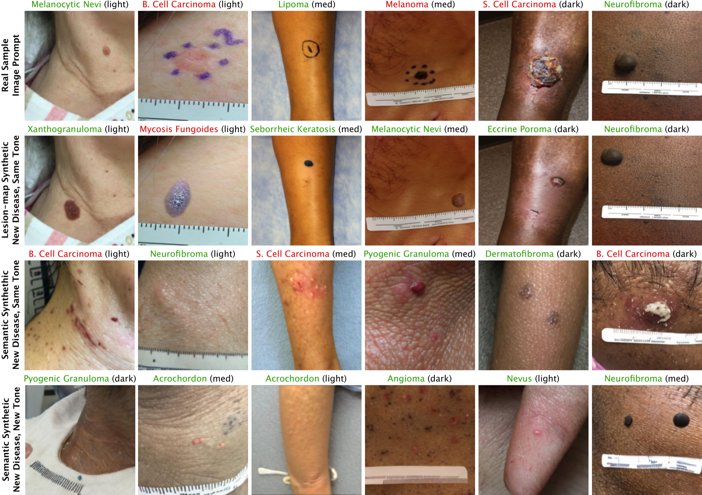
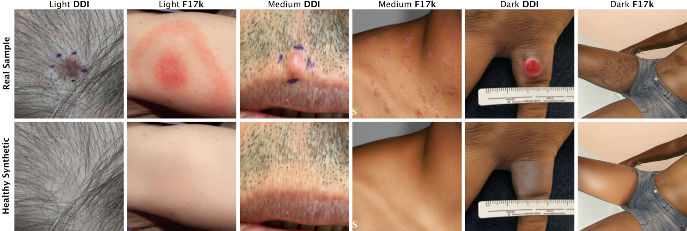

# [MICCAI 26] cgDDI: Controllable Generation of Diverse Dermatological Imagery for Fair and Efficient Malignancy Classification

[](Paper-1473.pdf)
[](https://arxiv.org/abs/2607.12987)
[](https://huggingface.co/datasets/hcarrion/ControllableGenDDI)
[](#per-disease-model-checkpoints)
[](LICENSE)

Accurate dermatological diagnosis naturally necessitates equitable performance across diverse populations, yet a systematic lack of expertly annotated images, especially for underrepresented skin tones and rare diseases, impedes progress toward measurably fair methods. We introduce **cgDDI** (**C**ontrollable **G**eneration of **D**iverse **D**ermatological **I**magery), a hybrid framework that (1) synthesizes realistic healthy skin samples without disturbing other input properties, (2) maps single-sample rare lesions onto novel skin-tones and locations non-parametrically, and (3) allows for efficient parametric generation with as few as 10 training samples. The framework supports both human and automated segmentation masking, enabling scalability to datasets without pre-made lesion masks. We grow a 656-image dataset by more than 400× and validate across two datasets: biopsy-confirmed Diverse Dermatology Images (DDI) and expert-verified Fitzpatrick17k (F17k). On the DDI benchmark, we achieve malignancy classification accuracy of 86.4% under synthetic-only training and 90.9% state-of-the-art performance with real data fine-tuning, alongside leading fairness metrics. Cross-dataset experiments show +13.9% accuracy improvements on unseen F17k data despite minimal disease overlap. We openly release 266k+ synthetic images, code, and generative models to further support fairness research at <https://github.com/hectorcarrion/ControllableGenDDI>.

<p align="center">
  
</p>

*The cgDDI framework. Original images, masks, and prompts produce **healthy synthetics**. These serve as targets for **lesion-mapped synthetics**, as prior-preservation anchors, and as semantic prompts. Disease-specific concepts are learned via textual inversion and used to fine-tune latent diffusion models from which **semantic synthetics** are sampled. The aggregated data trains **fair classifiers**.*

## Paper Availability

The MICCAI 2026 camera-ready PDF is hosted directly in this repository — **[Paper-1473.pdf](Paper-1473.pdf)** — and the paper is also on **arXiv: [2607.12987](https://arxiv.org/abs/2607.12987)**. The version of record will appear in the *Lecture Notes in Computer Science* proceedings volume shortly before the conference (Sept 27 – Oct 1, 2026, Strasbourg); the arXiv listing will be updated with the final Springer DOI once published.

## Key Results

### Malignancy classification on DDI, following PatchAlign strategy

| Method | Mean Acc. | Light | Med. | Dark | PQD | DPM | EOM |
|---|:---:|:---:|:---:|:---:|:---:|:---:|:---:|
| Baseline (Real) | 82.4 | 83.3 | 74.6 | 89.7 | 77.0 | 75.2 | 58.7 |
| FairDisCo | 83.8 | 88.6 | 71.7 | 92.0 | 78.0 | 72.8 | 63.7 |
| PatchAlign | 87.4 | 89.6 | 80.3 | 92.3 | 86.9 | 74.9 | 69.6 |
| **cgDDI (synth only)** | 86.4 | 88.9 | **84.1** | 86.0 | **94.6** | **82.0** | 81.9 |
| **cgDDI (synth + real)** | **90.9** | **93.3** | **86.4** | **93.0** | 92.5 | 68.8 | **86.6** |

All values in %. **PQD** (Predictive Quality Disparity), **DPM** (Demographic Parity), **EOM** (Equality of Opportunity) — higher = fairer. cgDDI lifts the most important fairness metric **EOM from 69.6 → 86.6** while reaching state-of-the-art accuracy across all skin-tone subgroups.

### Generated samples

<p align="center">
  
</p>

*Row 1: real images used as prompts. Row 2: lesion from a donor transplanted onto the prompt image (lesion mapping). Rows 3–4: semantic synthetics conditioned on the prompt, a target disease (<span style="color:red">malignant</span>/<span style="color:green">benign</span>), and target skin tone (light, medium, dark).*

### Healthy synthetics and skin-tone mixing

<p align="center">
  
</p>

cgDDI produces in-clinical-distribution **healthy skin** images across the full Fitzpatrick I–VI range — a resource not present in prior synthetic dermatology datasets.

## Dataset

Released openly on Hugging Face: [hcarrion/ControllableGenDDI](https://huggingface.co/datasets/hcarrion/ControllableGenDDI). The dataset contains:

- **Healthy synthetics** — 309 pixel-perfect in-distribution healthy skin images
- **Lesion-mapped synthetics** — single-sample rare-disease augmentations
- **Semantic synthetics** — textual-inversion + LoRA latent-diffusion samples
- **Fairness labels** — Fitzpatrick skin-tone tags for stratified evaluation

In total: **266,136 skin-tone-balanced synthetic images** across 65+ disease classes.

```bash
# Download dataset via the HF CLI
hf download hcarrion/ControllableGenDDI --repo-type dataset --local-dir data/cgddi
```

You will also need the **original DDI dataset** ([Diverse Dermatology Images](https://ddi-dataset.github.io/), Daneshjou et al. 2022) and **sDDI masks** ([FEDD](https://github.com/hectorcarrion/FEDD)) to reproduce the lesion-mapping pipeline. We do not re-host these artifacts.

## Per-disease model checkpoints

cgDDI also releases **65 disease-conditioned LoRA checkpoints**, one per condition, on Hugging Face. Each is a textual-inversion + LoRA adapter built on top of the base diffusion backbone.

<details>
<summary><b>Expand to see all 65 model URLs</b></summary>

| # | Disease | Checkpoint |
|---|---|---|
| 1 | xanthogranuloma | <https://huggingface.co/hcarrion/xanthogranuloma> |
| 2 | verruciform_xanthoma | <https://huggingface.co/hcarrion/verruciform_xanthoma> |
| 3 | verruca_vulgaris | <https://huggingface.co/hcarrion/verruca_vulgaris> |
| 4 | trichofolliculoma | <https://huggingface.co/hcarrion/trichofolliculoma> |
| 5 | trichilemmoma | <https://huggingface.co/hcarrion/trichilemmoma> |
| 6 | traumatic_injury | <https://huggingface.co/hcarrion/traumatic_injury> |
| 7 | tinea_pedis | <https://huggingface.co/hcarrion/tinea_pedis> |
| 8 | syringocystadenoma_papilliferum | <https://huggingface.co/hcarrion/syringocystadenoma_papilliferum> |
| 9 | squamous_cell_carcinoma | <https://huggingface.co/hcarrion/squamous_cell_carcinoma> |
| 10 | spindle_cell_nevus_of_Reed | <https://huggingface.co/hcarrion/spindle_cell_nevus_of_Reed> |
| 11 | solar_lentigo | <https://huggingface.co/hcarrion/solar_lentigo> |
| 12 | seborrheic_keratosis | <https://huggingface.co/hcarrion/seborrheic_keratosis> |
| 13 | sebaceous_carcinoma | <https://huggingface.co/hcarrion/sebaceous_carcinoma> |
| 14 | morphea | <https://huggingface.co/hcarrion/morphea> |
| 15 | scar | <https://huggingface.co/hcarrion/scar> |
| 16 | reactive_lymphoid_hyperplasia | <https://huggingface.co/hcarrion/reactive_lymphoid_hyperplasia> |
| 17 | pyogenic_granuloma | <https://huggingface.co/hcarrion/pyogenic_granuloma> |
| 18 | prurigo_nodularis | <https://huggingface.co/hcarrion/prurigo_nodularis> |
| 19 | onychomycosis | <https://huggingface.co/hcarrion/onychomycosis> |
| 20 | nevus_lipomatosus_superficialis | <https://huggingface.co/hcarrion/nevus_lipomatosus_superficialis> |
| 21 | nevus | <https://huggingface.co/hcarrion/nevus> |
| 22 | neuroma | <https://huggingface.co/hcarrion/neuroma> |
| 23 | neurofibroma | <https://huggingface.co/hcarrion/neurofibroma> |
| 24 | molluscum_contagiosum | <https://huggingface.co/hcarrion/molluscum_contagiosum> |
| 25 | metastatic_carcinoma | <https://huggingface.co/hcarrion/metastatic_carcinoma> |
| 26 | melanoma | <https://huggingface.co/hcarrion/melanoma> |
| 27 | lymphocytic_infiltrations | <https://huggingface.co/hcarrion/lymphocytic_infiltrations> |
| 28 | lipoma | <https://huggingface.co/hcarrion/lipoma> |
| 29 | lichenoid_keratosis | <https://huggingface.co/hcarrion/lichenoid_keratosis> |
| 30 | leukemia_cutis | <https://huggingface.co/hcarrion/leukemia_cutis> |
| 31 | keloid | <https://huggingface.co/hcarrion/keloid> |
| 32 | kaposi_sarcoma | <https://huggingface.co/hcarrion/kaposi_sarcoma> |
| 33 | hyperpigmentation | <https://huggingface.co/hcarrion/hyperpigmentation> |
| 34 | hematoma | <https://huggingface.co/hcarrion/hematoma> |
| 35 | graft-vs-host_disease | <https://huggingface.co/hcarrion/graft-vs-host_disease> |
| 36 | glomangioma | <https://huggingface.co/hcarrion/glomangioma> |
| 37 | foreign_body_granuloma | <https://huggingface.co/hcarrion/foreign_body_granuloma> |
| 38 | folliculitis | <https://huggingface.co/hcarrion/folliculitis> |
| 39 | focal-acral-hyperkeratosis | <https://huggingface.co/hcarrion/focal-acral-hyperkeratosis> |
| 40 | fibrous_papule | <https://huggingface.co/hcarrion/fibrous_papule> |
| 41 | epidermal_nevus | <https://huggingface.co/hcarrion/epidermal_nevus> |
| 42 | epidermal_cyst | <https://huggingface.co/hcarrion/epidermal_cyst> |
| 43 | atopic_dermatitis | <https://huggingface.co/hcarrion/atopic_dermatitis> |
| 44 | eccrine_poroma | <https://huggingface.co/hcarrion/eccrine_poroma> |
| 45 | dermatomyositis | <https://huggingface.co/hcarrion/dermatomyositis> |
| 46 | dermatofibroma | <https://huggingface.co/hcarrion/dermatofibroma> |
| 47 | cutaneous_T-cell_lymphoma | <https://huggingface.co/hcarrion/cutaneous_T-cell_lymphoma> |
| 48 | condyloma_acuminatum | <https://huggingface.co/hcarrion/condyloma_acuminatum> |
| 49 | coccidioidomycosis | <https://huggingface.co/hcarrion/coccidioidomycosis> |
| 50 | clear_cell_acanthoma | <https://huggingface.co/hcarrion/clear_cell_acanthoma> |
| 51 | chondroid_syringoma | <https://huggingface.co/hcarrion/chondroid_syringoma> |
| 52 | cellular_neurothekeoma | <https://huggingface.co/hcarrion/cellular_neurothekeoma> |
| 53 | blue_nevus | <https://huggingface.co/hcarrion/blue_nevus> |
| 54 | blastic_plasmacytoid_dendritic_cell_neoplasm | <https://huggingface.co/hcarrion/blastic_plasmacytoid_dendritic_cell_neoplasm> |
| 55 | benign_keratosis | <https://huggingface.co/hcarrion/benign_keratosis> |
| 56 | basal_cell_carcinoma | <https://huggingface.co/hcarrion/basal_cell_carcinoma> |
| 57 | arteriovenous_hemangioma | <https://huggingface.co/hcarrion/arteriovenous_hemangioma> |
| 58 | angioma | <https://huggingface.co/hcarrion/angioma> |
| 59 | angioleiomyoma | <https://huggingface.co/hcarrion/angioleiomyoma> |
| 60 | actinic_keratosis | <https://huggingface.co/hcarrion/actinic_keratosis> |
| 61 | acrochordon | <https://huggingface.co/hcarrion/acrochordon> |
| 62 | acral_melanotic_macule | <https://huggingface.co/hcarrion/acral_melanotic_macule> |
| 63 | acquired_digital_fibrokeratoma | <https://huggingface.co/hcarrion/acquired_digital_fibrokeratoma> |
| 64 | acne-cystic | <https://huggingface.co/hcarrion/acne-cystic> |
| 65 | abscess | <https://huggingface.co/hcarrion/abscess> |

</details>

## Usage

Code is provided as Jupyter notebooks. The pipeline was developed and primarily executed on Colab; most dependencies come pre-installed there, and notebooks include `!pip install` calls for the rest. Notebooks contain embedded result visualizations that GitHub may not render — open locally or in Colab if needed.

| Stage | Notebook / script | Notes |
|---|---|---|
| 1. Healthy synthetics | [`healthy_gen.ipynb`](healthy_gen.ipynb) | Latent-diffusion in-painting on real DDI images using sDDI masks. |
| 2. Lesion mapping | [`lession_mapping.ipynb`](lession_mapping.ipynb) | Non-parametric transplant of single-sample rare lesions onto new skin tones / locations. |
| 3. Textual inversion | [`textual_inversion.ipynb`](textual_inversion.ipynb) / [`textual_inversion.py`](textual_inversion.py) | Learn disease-specific concept tokens. A CSV of DDI images with disease labels is required (template in notebook). Driver: [`train_ti.bash`](train_ti.bash). |
| 4. LoRA fine-tuning | [`train_lora.ipynb`](train_lora.ipynb) / [`train_lora.py`](train_lora.py) | Fine-tune the diffusion model with disease tokens; prior-preservation loss anchored on healthy synthetics. |
| 5. Semantic sampling | [`semantic_sampling.ipynb`](semantic_sampling.ipynb) | Sample disease- and skin-tone-conditioned synthetics from the LoRA-fine-tuned model. |
| 6. Fair classification | external: [PatchAlign24](https://github.com/aayushmanace/PatchAlign24) | Replace input directories with the cgDDI ones. **Drop lesion-mapped rows generated from prompts inside the test split** to avoid leakage. |

## Usage Terms

We release this data, code and models with the intent of academic use and to promote fairness research. We do not condone unethical use of these artifacts.

## Acknowledgements

We thank the open-source communities behind [HuggingFace Diffusers](https://github.com/huggingface/diffusers) for in-painting and LoRA implementations, [Skin-Diff](https://github.com/janet-sw/skin-diff/tree/main), [FairDisCo](https://github.com/siyi-wind/FairDisCo) and [PatchAlign](https://github.com/aayushmanace/PatchAlign24) for providing baselines and a classification protocol upon which we build this repo. We also build on [FEDD](https://github.com/hectorcarrion/FEDD) for sDDI segmentation masks.

## Citation

```bibtex
@inproceedings{carrion2026cgddi,
  title     = {Controllable Generation of Diverse Dermatological Imagery for Fair and Efficient Malignancy Classification},
  author    = {Carri{\'o}n, H{\'e}ctor and Norouzi, Narges},
  booktitle = {Medical Image Computing and Computer-Assisted Intervention (MICCAI)},
  year      = {2026},
  publisher = {Springer},
  series    = {Lecture Notes in Computer Science},
  eprint    = {2607.12987},
  archivePrefix = {arXiv}
}
```

## License

See [LICENSE](LICENSE) for details.
